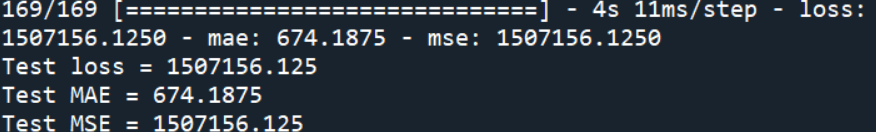

# Exercise-2-Diamond-Price-Prediction
## 1. Objective
To create a Feedforward Neural Network model to predict the price of diamonds, based on the following features:   
&nbsp;&nbsp; i. &nbsp; 4C (cut,clarity,color,carat)    
&nbsp;&nbsp; ii. &nbsp; dimensions (x,y,z)    
&nbsp;&nbsp; iii.&nbsp;  depth    
&nbsp;&nbsp; iv. &nbsp; table    

## 2. Dataset
The dataset is obtained from [Diamonds dataset](https://www.kaggle.com/datasets/shivam2503/diamonds).

## 3. IDE and Framework
- <b>IDE<b>: Sypder   
- <b>Frameworks<b>: Pandas, Numpy, Scikit-learn and TensorFlow Keras.
  
## 4. Results
The model are tested with test data. The evaluation result is shown in figure below.

The model is also used to made prediction with test data. A graph of prediction vs label is plotted, as shown in the image below.

Based on the graph, a clear trendline of y=x can be seen, indicating the predictions are fairly similar as labels. However, several outliers can be seen in the graph.

